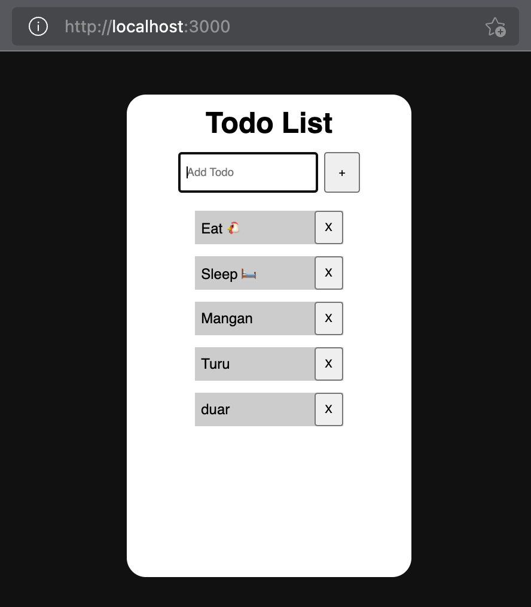

# Day 1 Hands-On Training ARC 2022 (Full-stack)
## Deskripsi aplikasi
Aplikasi ini merupakan pengembangan aplikasi todo pada hands-on day 1 menjadi aplikasi full-stack.
Aplikasi ini memiliki fitur:
  - Melihat daftar todo
  - Menambah todo
  - Menghapus todo
## Cara penggunaan aplikasi
### Melihat daftar todo
Daftar todo akan langsung terlihat saat laman aplikasi dibuka
### Menambah todo baru
1. Ketikkan isi todo pada kotak input di bagian atas
2. Tekan tombol (+) di samping kotak input untuk menambah todo
### Menghapus todo
1. Pilih todo yang hendak dihapus
2. Tekan tombol (x) di samping todo yang hendak dihapus
## Screenshot aplikasi

